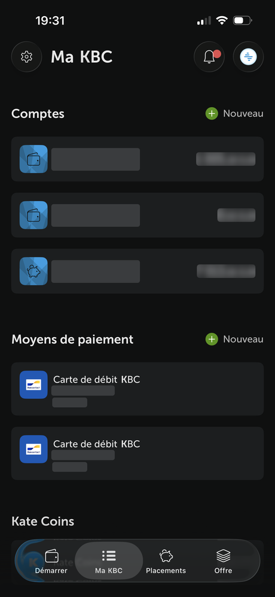

<div align="center">


**Today the banking app shows the same blocks to everyone.**<br>
KBC Fit shows each customer the one thing that is useful to them — with a number and a reason.<br>
And when nothing is useful, it says so.

[**→ Try the live demo**](https://hackaton-2026-three.vercel.app/)

[](https://hackaton-2026-three.vercel.app/)


<sub>Built for the KBC challenge at Tectonic Hackathon 2026.</sub>

</div>

---

## The problem

Here is the home screen of the banking app as it is today.

<div align="center">

</div>

It is an **inventory**. Three accounts, two debit cards, the balances. It tells the customer *what they have*, and stops there.

What it never tells them is what any of it means:

- **Nothing adapts.** The same list, in the same order, whether the account holds €340 or €54,400, whether the customer is 24 and renting or 66 and retired. Nothing on this screen is a function of who is looking at it.
- **Nothing is proposed.** There is no suggestion tied to this customer's actual situation. The screen has no opinion.
- **There is no plan.** No target, no amount, no horizon. Nothing says what to do next, in what order, or by when.
- **Nothing is explained.** A balance is a number without context. Is this too much to leave on a current account? Is something missing? The app does not say — so the customer has to already know what to ask.

The information needed to do better is already inside the bank: the salary arriving every month, the products held, the money that has not moved in a year. Almost none of it reaches the screen.

KBC is already proactive — Kate reports personalised suggestions in more than 140 situations. Our reading is that those situations are triggers built one at a time. That works, and it does not scale: covering 2.3 million customers by hand-writing a trigger per case is a losing race.

> Screenshot of the current app, relabelled from CBC to KBC — the same group's French-speaking Belgian brand, and the same screen. The account holder's name, the account numbers and the card numbers have been removed.

---

## The solution

**KBC Fit** is a decision engine that reads a customer's signals, measures a gap, and recomposes the screen around the single most useful thing — or stays quiet.

**→ [hackaton-2026-three.vercel.app](https://hackaton-2026-three.vercel.app/)** — pick a customer, press *Activate KBC Fit*, and watch the same screen re-compose. Everything runs from this repository; there is nothing to install to try it.

It works in five steps:

| Step | What happens |
|---|---|
| **1. Read** | Weighted signals — transactions, products held, and situations the customer **declared themselves**. Only with consent. |
| **2. Measure** | A concrete gap: something missing, or money sitting idle. |
| **3. Decide** | Deterministic rules, not a language model. A confidence score decides whether to speak at all. |
| **4. Compose** | A quantified goal, the reason behind it, and one next step. |
| **5. Explain** | Every signal used is shown, and can be switched off. |

---

## What changes when you activate it

The same customer, the same data, one screen rebuilt around the single thing that is worth their attention. Open the [live demo](https://hackaton-2026-three.vercel.app/), pick a customer and press **Activate KBC Fit** to watch it happen.

The benefits, concretely:

- **A number instead of a slogan.** Not "think about your pension" but *€110 a month, goal reached December 2064, you are at 6% today*.
- **A reason you can audit.** Every card lists the signals behind it. Switch one off and the recommendation changes in front of you — below **60% confidence** the card disappears entirely rather than guessing.
- **A plan, not a list.** A target, a horizon, a monthly amount capped at 40% of what the customer actually has left, and one next step.
- **Consent is a switch, not a checkbox.** Turn consent off and nothing is read at all; the screen falls back to the plain inventory above.
- **The right to say nothing.** Claire is already well covered, so KBC Fit proposes nothing and explains what it checked. An app that stays silent when it has nothing useful earns attention when it speaks.
- **It scales.** One small stateless calculation per customer. A new case is new data and a new rule — not a new hand-built trigger.

### The four customers

| Customer | Situation | What KBC Fit shows |
|---|---|---|
| **Lucas, 24** | First salary, renting, no pension product | €110/month toward €100,000 at 64 — at 6% today |
| **Thomas, 31** | Just became a father — a situation he *declared himself* | A savings goal for *Your child at 18* |
| **Monique, 66** | Retired, €54,400 on the current account | €39,454 idle above a €14,946 cushion — 73% inactive (from her real spending in the database) |
| **Claire, 38** | Savings invested, insurance in place | Nothing to suggest, and what was checked |

---

## How the decision is made

No language model decides anything. The engine is a pure TypeScript module with no dependencies, covered by unit tests.

```
confidence = sum of the weights of the active signals

no consent            →  nothing is read
no gap                →  "nothing to suggest"
confidence < 0.60     →  the card is hidden
otherwise             →  the card is composed
```

The constants are frozen in [`src/lib/engine/types.ts`](src/lib/engine/types.ts):

| Constant | Value | Meaning |
|---|---|---|
| `THRESHOLD` | `0.60` | Below this confidence, say nothing |
| `ANNUAL_RATE` | `3%` | Illustrative growth assumption — **not** a KBC rate |
| `MARGIN_CAP` | `40%` | A goal never asks for more than this share of monthly margin |
| `CUSHION_MONTHS` | `6` | Months of expenses kept before cash counts as idle |

Amounts are simulator assumptions, products are generic categories, and nothing is ever subscribed — the next step opens a confirmation sheet and stops there.

---

## Run it locally

```bash
git clone https://github.com/Kepaaaaa/hackaton_2026.git
cd hackaton_2026
npm install
npm run dev          # http://localhost:3000
```

| Script | What it does |
|---|---|
| `npm run dev` | Development server |
| `npm run build` | Production build |
| `npm run start` | Serve the production build |
| `npm test` | Engine unit tests (Vitest) |
| `npm run typecheck` | `tsc --noEmit` |
| `npm run lint` | ESLint |

No environment variables are needed to run the demo: without Supabase, the site reads the offline snapshot of the database and shows an "Offline snapshot" badge.

**With a local Supabase** (Docker required):

```bash
npx supabase start                  # applies supabase/migrations and loads supabase/seed.sql
# then, in .env.local (ignored by Git):
#   SUPABASE_URL=http://127.0.0.1:54321
#   SUPABASE_PUBLISHABLE_KEY=<PUBLISHABLE_KEY printed by supabase start>
npm run dev                         # the badge now says "Live: Supabase"
```

**On Vercel:** add the Supabase integration to the project. It sets `SUPABASE_URL` and `SUPABASE_PUBLISHABLE_KEY`. Then create the table and load the data once, in the Supabase SQL editor: run `supabase/migrations/*_personas.sql`, then `supabase/seed.sql`. Or from a terminal: `npx supabase link` then `npx supabase db push --include-seed`.

---

## Project structure

```
src/
  app/                  /, /demo/[persona]
  components/
    home/               persona picker cards
    demo/               activation panel, problems panel
    phone/              BEFORE and AFTER phone screens
    brand/              logo, header, footer
  lib/
    engine/             types, decision rules, tests  <- the frozen contract
    data/               Supabase access, offline snapshot, portrait mapping
datasets/               synthetic data generator (Python)
supabase/               migration (table personas, RLS) and seed.sql
docs/
  kbc-brand.md          KBC Design Language tokens
  assets/               images used by this README
scripts/
  personas.mjs          regenerates the persona portraits
  supabase-seed.mjs     writes supabase/seed.sql from the database export
public/
  brand/  personas/     logo and portrait assets
```

## Data and security

- **100% synthetic data.** No real customer, no real account and no real IBAN anywhere in this repository. The personas are exported from a generator that simulates 10,000 Belgian retail customers over 24 months — accounts, transactions, insurance and web sessions, each with a reason behind it. See [`datasets/README.md`](datasets/README.md).
- Persona data lives in **Supabase** (table `personas`), read on the server with the publishable key. **No customer data is written in the code**: every persona is built from its database record. If Supabase is unreachable, the app **falls back to an offline snapshot of the same records** and never shows an error page.
- The table is **read-only**: RLS is on and the Data API roles can only `select`. The app uses no secret key. Keys live in Vercel environment variables, **never in Git**. This repository is public.
- Inputs are validated with Zod. Persona slugs are a fixed allow-list, so unknown routes 404 instead of doing a free-form lookup.
- Security headers (CSP, `frame-ancestors`, `Referrer-Policy`, `nosniff`, `Permissions-Policy`) are set in [`next.config.ts`](next.config.ts).

## Status

| Part | State |
|---|---|
| Persona picker and demo screens | Done |
| Decision engine and unit tests | Done |
| BEFORE/AFTER transition, problems panel | Done |
| Personas built from Supabase records, with offline snapshot | Done |
| Synthetic dataset generator (bank, web, ground truth) | Done |
| `/how-it-works` explanation page | Planned |
| Login | Last step, only if time allows |

## Notes

- Hackathon concept. KBC branding and the KBC Design Language are used with KBC for this challenge — see [`docs/kbc-brand.md`](docs/kbc-brand.md).
- The KBC font (Museo Sans) is commercial and is never committed; Nunito Sans is the fallback.
- Amounts use an illustrative 3% a year. These are not KBC rates, and any real investment goes through an advisor.
